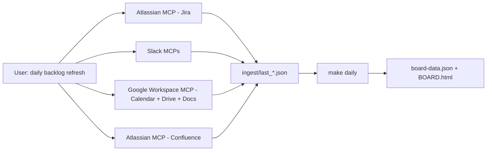

# Daily backlog refresh — agent runbook

**Trigger phrase**: `daily backlog refresh`

This runbook is meant for the Cursor **agent** (not a Python script). The agent calls the MCP servers, writes staged JSON into `troy-beta/backlog/ingest/`, and then you run the terminal command.

## Quick flow



Watermarks live in [`sync_state.yaml`](sync_state.yaml). **Read** them before the pulls (scope each query to "since last_run"); the Python driver **writes** them after a successful merge.

Full JSON shapes are documented in [`QUERY_PACKS.md`](QUERY_PACKS.md). This file only documents the **order of MCP calls** and the output file per step.

---

## Step 1 - Jira

Source: `plugin-atlassian` (or equivalent Atlassian MCP).

```text
JQL: (assignee = currentUser() OR reporter = currentUser()) AND updated >= "<sync_state.jira.last_run or 2025-04-01>" ORDER BY updated DESC
```

- Paginate with `startAt` until a page returns fewer than `maxResults` issues.
- Merge all pages into a single JSON with a top-level `issues` array.
- **Write to** [`last_jira_currentUser.json`](last_jira_currentUser.json).

## Step 2 - Slack channel mentions

Channels: keep only channels whose name, split on `-`, contains any of `{troy, us, da, ccf}`.

1. `conversations_list types=public_channel,private_channel` → filter channels by the token-boundary rule.
2. For each kept channel: `conversations_history channel=<id> oldest=<sync_state.slack_mentions.last_run as epoch>`.
3. Keep messages that `@mention` you (`<@U...>` resolves to you, or the text contains `@jacqueline.ponce`).
4. `chat_getPermalink` per message.
5. **Write to** [`last_slack_mentions.json`](last_slack_mentions.json) — shape in [`QUERY_PACKS.md`](QUERY_PACKS.md) §2a.

## Step 3 - Slack DMs and group DMs

1. `conversations_list types=im,mpim`.
2. For each: `conversations_history channel=<id> oldest=<sync_state.slack_dms.last_run>`.
3. Skip threads whose latest message is from you.
4. Collapse consecutive messages from the same author in the same thread.
5. **Write to** [`last_slack_dms.json`](last_slack_dms.json) — shape in `QUERY_PACKS.md` §2a.

## Step 3b - Slack "Saved for later" / bookmarks

Source: `plugin-slack-slack` (`slack_search_public_and_private`).

1. `slack_search_public_and_private query="is:saved" sort="timestamp" sort_dir="desc" response_format="detailed" include_context=false limit=20`.
2. Follow `pagination_info` cursors until `End of results`. Each page returns up to 20 hits.
3. Parse each hit (channel id/name, author id/name, `Message_ts`, `Permalink`, `Text`) into the shape below. Derive `thread_ts` from the permalink's `thread_ts=` query param when present.
4. **Write to** [`last_slack_saved.json`](last_slack_saved.json) — shape in `QUERY_PACKS.md` §2a.

> Watermark: always do a full refresh for this feed (Slack does not expose a per-save timestamp). The driver de-dupes by stable id, so re-reading is safe and cheap (≈few dozen rows).

## Step 4 - Google Calendar + Gemini transcriptions

Source: Google Workspace MCP (Calendar + Drive + Docs).

1. `calendar_listEvents` on the primary calendar, window `[sync_state.gcal_gemini.last_run - 1d, now + 1d]`.
2. Keep events where you are in `attendees` (any `responseStatus`, including `needsAction` — "didn't attend" is fine).
3. For each event, locate the Gemini notes doc:
   - Parse `docs.google.com/document/d/...` out of `event.description` or `event.attachments[]`.
   - Fallback: `drive_search` by `name` containing the event title inside the `Meet Recordings` folder.
4. **Write events to** [`last_gcal_events.json`](last_gcal_events.json).
5. For each doc, `docs_read` and extract items under Action items / Next steps / Follow-ups / TODO / Próximos passos / Ações / Pendências / A fazer. Keep only items that reference **you** (Jacqueline / Jacque / @jacqueline.ponce). PT and EN both supported.
6. **Write parsed items to** [`last_gemini_docs.json`](last_gemini_docs.json). If you cannot pre-parse, include the raw section text under a `raw_text` key — the Python fallback will extract bullets.

## Step 5 - Confluence comments that need a reply

Source: Atlassian MCP (Confluence search + comments).

1. CQL search: `type = "page" AND (creator = currentUser() OR mention = currentUser())` — narrow to last 365 days.
2. For each returned page, fetch **footer + inline** comments.
3. For each comment, decide `mentions_me`, `comment_author_is_me`, and `has_my_reply_after` (walk the thread after the comment; true iff you posted any later reply in the same thread).
4. **Write to** [`last_confluence_comments.json`](last_confluence_comments.json) — shape in `QUERY_PACKS.md` §8. Let the driver apply the inclusion rule.

---

## Step 6 - Run the terminal command

After all 5 staged JSONs are written (Jira + Slack mentions + Slack DMs + Slack saved + GCal/Gemini + Confluence):

```bash
cd ~/Documents/cursor/troy-beta/backlog
make daily
```

That runs [`scripts/daily_refresh.py`](../scripts/daily_refresh.py), which:

1. Turns each JSON into items via `scripts/sources/*`.
2. Merges with [`local_items.yaml`](../local_items.yaml).
3. Applies [`local_overrides.yaml`](../local_overrides.yaml) (to close Slack/Gemini/Confluence loops with `status: done`).
4. Writes [`items.yaml`](../items.yaml) and regenerates the board.
5. Bumps [`sync_state.yaml`](sync_state.yaml) so tomorrow's run is smaller.

## Partial runs

If one source MCP is unavailable, you can still run a subset. Examples:

```bash
.venv/bin/python scripts/daily_refresh.py --only jira,slack
.venv/bin/python scripts/daily_refresh.py --only jira --no-bump-state   # dry-ish
```

Only the source modules listed in `--only` will have their watermarks bumped.
